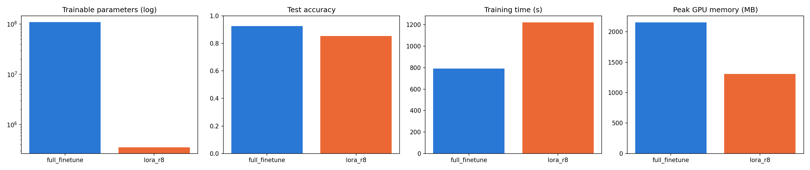
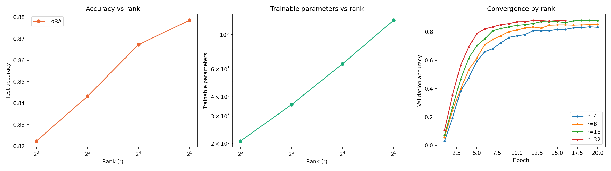

# bert-lora-finetuning


Fine-tuning `bert-base-uncased` for 77-class intent classification ([Banking77](https://huggingface.co/datasets/PolyAI/banking77)),
comparing **full fine-tuning** against **LoRA** (Low-Rank Adaptation) — both via HuggingFace's `peft`
library and via a from-scratch implementation, with an empirical rank sweep.

## Why this project

Full fine-tuning updates all ~110M of BERT's parameters per task: expensive to train (Adam's optimizer
state roughly quadruples the memory cost per trainable parameter) and expensive to deploy (one full
checkpoint per task, no sharing). LoRA freezes the pretrained weights and represents the task-specific
update as the product of two small matrices, cutting trainable parameters by orders of magnitude while
aiming to preserve most of full fine-tuning's accuracy.

This project measures that trade-off directly rather than citing it: same model, same data, same training
config, both fine-tuning methods, real numbers.

## Results

*Fill in after running the notebooks — do not leave these as placeholders in the final version.*

**Full fine-tune vs. LoRA (r=8)** — from `notebooks/01_baseline_full_finetune_vs_lora.ipynb`:

| Method | Trainable params | % of total | Accuracy | Macro F1 | Train time (s) | Peak GPU mem (MB) |
|---|---|---|---|---|---|---|
| Full fine-tune | — | — | — | — | — | — |
| LoRA (r=8) | — | — | — | — | — | — |



**LoRA rank sweep (r = 4, 8, 16, 32)** — from `notebooks/02_lora_rank_sweep.ipynb`:

| Rank | Trainable params | Accuracy | Macro F1 | Train time (s) |
|---|---|---|---|---|
| 4 | — | — | — | — |
| 8 | — | — | — | — |
| 16 | — | — | — | — |
| 32 | — | — | — | — |



**One-paragraph finding:** *write this after both notebooks have run — state plainly what rank was
sufficient to approach full fine-tune accuracy, and what it cost in exchange. If LoRA underperformed
noticeably, say so and say why (undertrained, wrong target modules, rank too low) rather than
hedging around it.*

## Repo structure

```
bert-lora-finetuning/
├── notebooks/
│   ├── 01_baseline_full_finetune_vs_lora.ipynb   # main comparison, run this first
│   ├── 02_lora_rank_sweep.ipynb                   # r = 4, 8, 16, 32, independent of 01
│   └── 03_lora_from_scratch_demo.ipynb            # no GPU needed, demos src/ directly
├── src/
│   └── lora_from_scratch.py    # minimal LoRA linear layer, no peft dependency
├── tests/
│   └── test_lora_from_scratch.py   # run in CI on every push
├── results/                    # CSV/JSON/PNG outputs saved by the notebooks
├── requirements.txt
└── .github/workflows/ci.yml
```

## How to run

1. **Notebooks 01 and 02** need a GPU — upload to [Colab](https://colab.research.google.com) or
   [Kaggle](https://kaggle.com/code) with a GPU runtime. Each notebook installs its own dependencies
   in its first cell.
   - Run `01` first, note the printed full-fine-tune accuracy, paste it into `02`'s
     `FULL_FINETUNE_ACCURACY` constant so the rank-sweep plot has a reference line.
   - `01` and `02` don't depend on each other's *execution* — if you're splitting this across two
     machines, one person can run `01` while the other runs `02` in parallel; just sync the
     `FULL_FINETUNE_ACCURACY` value into `02` afterward (or leave it `None` and add the line later).
2. **Notebook 03** and the test suite run anywhere, no GPU or internet needed beyond installing `torch`:
   ```bash
   pip install -r requirements.txt
   pytest tests/ -v
   ```

## Limitations — read before citing the results

- **Single seed.** Every run here is one training run, not an average over multiple seeds. Treat the
  numbers as directional, not statistically validated — the same caveat applies here as it did to an
  earlier single-seed model comparison in this internship's other work.
- **One dataset, one base model.** Banking77 + `bert-base-uncased` only. Nothing here demonstrates the
  finding generalizes to other tasks or model sizes.
- **`target_modules=["query", "value"]` only**, not all linear layers (e.g. not the FFN or output
  projection) — a common LoRA default, not an exhaustively justified choice.
- **No hyperparameter search** beyond the rank sweep — learning rate, alpha, dropout are fixed values,
  not tuned.
- This is a research/comparison notebook, not production code — no error handling, config management, or
  deployment tooling beyond the `merge()` demonstration in notebook 03.

## License

MIT — see [LICENSE](LICENSE).
