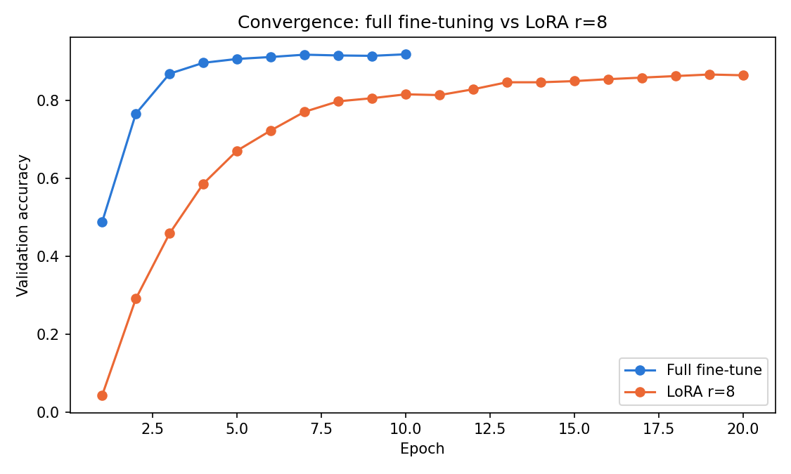

# bert-lora-finetuning


Fine-tuning `bert-base-uncased` for 77-class intent classification ([Banking77](https://huggingface.co/datasets/PolyAI/banking77)),
comparing **full fine-tuning** against **LoRA** (Low-Rank Adaptation) — via HuggingFace's `peft` library
and via a from-scratch implementation, with an empirical rank sweep.

## Why this project

Full fine-tuning updates all ~110M of BERT's parameters per task. That is expensive to train — Adam
keeps two optimizer states per trainable parameter, so memory scales with the number of parameters you
are actually updating — and expensive to deploy, since every task needs its own full checkpoint.

LoRA freezes the pretrained weights and represents the task-specific update as the product of two small
matrices, `ΔW = (alpha/r)·BA`. The claim is that most of the accuracy survives while the trainable
parameter count drops by orders of magnitude. This project measures that claim directly rather than
citing it: same model, same data, same protocol, both methods, real numbers.

## Results

**Full fine-tune vs. LoRA (r=8)** — from `notebooks/01_baseline_full_finetune_vs_lora.ipynb`:

| Method | Trainable params | % of total | Accuracy | Macro F1 | Epochs | Train time | Peak GPU mem |
|---|---|---|---|---|---|---|---|
| Full fine-tune | 109,541,453 | 100% | 92.7% | 0.927 | 10 | 790s | 2,155 MB |
| LoRA (r=8) | 354,125 | 0.32% | 85.4% | 0.852 | 20 | 1,222s | 1,306 MB |


**The trade-off.** LoRA retained **92% of full fine-tuning's accuracy** (85.4% against 92.7%, a gap of
7.3 points) while training **0.32% of the parameters** — 309× fewer — and using **39% less peak GPU
memory** (1,306 MB against 2,155 MB).

It was *slower* in wall clock: 1,222s against 790s, or 1.55×. That number is easy to misread. Per epoch
LoRA is about 23% faster (61s against 79s), because there are far fewer gradients to compute and far
fewer optimizer states to update. It simply needed twice as many epochs to get where it got. The saving
is in memory and parameter count, not in time-to-result.



The convergence plot is where the remaining accuracy gap becomes legible. Full fine-tuning is
essentially flat from epoch 5 onward. LoRA is still improving at epoch 20, where its budget ran out —
so **85.4% is a lower bound, not a converged value**, and some unknown fraction of that 7.3-point gap is
training budget rather than a limit of the method.

**LoRA rank sweep (r = 4, 8, 16, 32)** — from `notebooks/02_lora_rank_sweep.ipynb`:

*Pending — this notebook has not been run yet. The table and the diminishing-returns figure go here.*

| Rank | Alpha | Trainable params | Accuracy | Macro F1 | Epochs | Train time |
|---|---|---|---|---|---|---|
| 4 | 8 | | | | | |
| 8 | 16 | | | | | |
| 16 | 32 | | | | | |
| 32 | 64 | | | | | |

### Results dashboard

`dashboard.html` renders these numbers from `results/*.json` — it has no build step and nothing in it is
typed by hand, so it updates whenever the notebooks are re-run and the results re-committed. Serve the
repo root over HTTP and open it:

```bash
python -m http.server 8000
# then open http://localhost:8000/dashboard.html
```

Opening the file directly as `file://` will not work — the browser blocks the `fetch` calls and every
panel reads as empty.

## Protocol

The two methods are **not** given a matched epoch budget, and that is deliberate. LoRA optimizes a much
smaller parameter space and needs more steps to reach the same place; holding epochs equal understates
it. An earlier version of this repo did exactly that, gave both arms 4 epochs, and reported LoRA at
46.9% — a configuration artifact, not a finding.

Instead each method trains until it stops improving:

- Banking77 ships train/test only, so a stratified **90/10 split is carved out of train** for validation.
  The test split is untouched until the final evaluation.
- Both arms use **early stopping on validation accuracy** (`load_best_model_at_end`), and report the
  best checkpoint against the held-out test set.
- **Steps to convergence is recorded as a result**, not held constant.
- Learning rates differ by method, as they should: 2e-5 for full fine-tuning, 2e-4 for LoRA, both with
  6% warmup. A fresh 77-way classification head at 2e-4 diverges in the first epoch without it.

## Repo structure

```
bert-lora-finetuning/
├── notebooks/
│   ├── 01_baseline_full_finetune_vs_lora.ipynb   # main comparison, run this first
│   ├── 02_lora_rank_sweep.ipynb                   # r = 4, 8, 16, 32, independent of 01
│   └── 03_lora_from_scratch_demo.ipynb            # no GPU needed, demos src/ directly
├── src/
│   └── lora_from_scratch.py    # minimal LoRA linear layer, no peft dependency
├── tests/
│   └── test_lora_from_scratch.py   # run in CI on every push
├── results/                    # CSV/JSON/PNG written by the notebooks
├── dashboard.html              # reads results/*.json, no build step
├── requirements.txt
└── .github/workflows/ci.yml
```

## How to run

1. **Notebooks 01 and 02** need a GPU — upload to [Colab](https://colab.research.google.com) or
   [Kaggle](https://kaggle.com/code) with a GPU runtime. Each installs its own dependencies in its first
   cell. Budget roughly 35 minutes for `01` and 1.5–2 hours for `02`.
   - `01` and `02` do not depend on each other's execution and can run in parallel on two machines.
     `02` picks up the full-fine-tune reference line automatically from `results/01_baseline_comparison.json`
     if that file is present, and omits the line if it isn't.
   - Download the generated `results/` files from the runtime's output panel and commit them; that is
     what the README tables and the dashboard read.
2. **Notebook 03** and the test suite run anywhere, no GPU:
   ```bash
   pip install -r requirements.txt
   pytest tests/ -v
   ```

## Limitations — read before citing these numbers

- **LoRA did not converge.** It hit the 20-epoch ceiling while validation accuracy was still rising, so
  85.4% is a floor. The honest version of the headline is "at least 92% of full fine-tuning accuracy,"
  not "exactly 92%." Re-running with a larger budget would narrow the gap by an unknown amount.
- **Single seed.** One training run per configuration, not an average. Treat the numbers as directional,
  not statistically validated — a 7.3-point gap from one seed each is suggestive, not conclusive.
- **One dataset, one base model.** Banking77 and `bert-base-uncased` only. Nothing here shows the result
  generalizes to other tasks or model sizes.
- **`target_modules=["query", "value"]` only** — not the FFN or output projections. This follows the
  original LoRA paper's attention-only setting; it is a convention, not a tuned choice.
- **No hyperparameter search** beyond the rank sweep. Learning rate, alpha and dropout are fixed.
- **Memory is measured as peak allocation**, via `torch.cuda.max_memory_allocated`, taken as the max
  across visible devices. An earlier version read device 0 only and reported the two methods backwards.
- This is comparison code, not production code — no error handling, config management, or serving
  beyond the `merge()` demonstration in notebook 03.

## License

MIT — see [LICENSE](LICENSE).